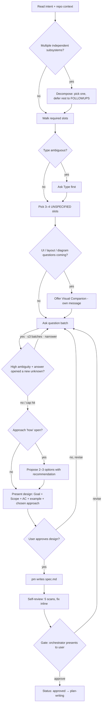

# Brainstorming

## Why this exists

Most "we have to rewrite this" stories trace back to one missed beat: the team started coding before the design was real. The intent was a sentence, the AC was implied, the tech stack was assumed, the scope hid two independent subsystems, and three "approaches" later nobody could remember why option B got picked. Catching all of that at brainstorming time costs minutes; catching it at review or in prod costs cycles, weekends, and trust.

This skill is the pre-spec discipline. In the `/dev` workflow it sits at Phase 1 step 6 — the orchestrator's interview — and runs *before* spawning `pm` to write `spec.md`. Outside `/dev` it runs any time the user wants to think through an idea before code lands.

The promise is small: explore context first, name the unknowns honestly, ask only what the intent didn't already pin, propose 2–3 ways to do it with a recommendation, and re-read the spec with fresh eyes before letting status flip to `approved`.

## The 7 principles

### 1. Explore project context BEFORE asking anything

The intent is one sentence; the codebase already has answers. Read `CLAUDE.md`, `.workflow/INDEX.md`, the last few commits, and any file the intent names *before* the first question. The interview gets sharper when you already know which file the feature plugs into, what stack is in play, and which conventions already exist.

Skipping this and going straight to "tell me about X" wastes questions on things the repo would have told you. Questions are scarce — don't burn one asking the language when `package.json` is sitting right there.

**Log what the repo answered as an assumption, not a fact.** When the repo (not the user) answers a slot — stack from `package.json`, integration point from the file the intent names, a convention from a sibling module — that inference can be wrong (the repo uses Postgres for service A; this feature lives in service B on Mongo). Keep a short running list of these repo-inferred answers and hand it to the orchestrator to surface at the gate as `Assumptions (inferred — correct me if wrong)`. A wrong inference nobody saw silently corrupts the spec and survives every internal-consistency scan; a one-line veto at the gate is the cheap fix.

### 2. Decompose oversized scope BEFORE refining details

If the intent describes multiple independent subsystems (e.g., "build a platform with chat, file storage, billing, and analytics"), surface that immediately. Don't spend the interview refining details of a request that needs to be broken up first.

The test: can this be one approved spec that produces one ship-able thing? If not, name the pieces, ask the user which one to scope first, and carry the rest to `FOLLOWUPS.md` as candidates for separate `/dev` runs. Inside `/dev`, this is also what triggers the `epic.md` path — the gate will split it anyway, so flag it here.

### 3. Ask only about UNSPECIFIED slots — never re-ask what the intent already pinned

The **authoritative slot list and trigger rules live in `.workflow/_templates/spec.md`** (in the `<!-- ... -->` trigger menu below the always-required sections) and the slot summary in `.claude/agents/pm.md > Slots`. Read those before the interview — the model is **minimum floor + triggered**, and most slots only appear when the work justifies them.

**Minimum floor (always asked or pulled from intent):** `Type`, `Goal`, `Acceptance criteria`, `Ship as`, `Open PR on ship`. AC may be just 1 for XS; each consequential *behavioural* AC also carries an `on error / at boundary:` line (the unhappy-path decision, or an explicit `none — <default>`) and edges live as sub-bullets under the AC they edge (NOT a separate section). Measurable perf/security/a11y targets are themselves ACs (verify = the `measured:` clause), not a separate untestable section — an NFR-class AC carries neither `e.g.` nor `on error / at boundary`.

**Everything else is triggered** — `Problem`, `Users`, `User journey`, `Scope — Out`, `NFR`, `DoD`, `Constraints`, `Reproduction` (REQUIRED for `Type=fix`), `Timebox` (REQUIRED for `Type=spike`), `Discovery notes`, `Carry-over`. The template comment for each section names the trigger condition; ask only when it fires.

Walk the intent. For each triggered slot, first decide whether the trigger fires at all. If not, the slot is not just unanswered — it does not exist for this spec. If yes: *did the user already answer this, or did the repo answer it?* Only the **triggered AND unanswered** slots become interview questions. **Never** assume defaults for slots you didn't ask about, and **never** include a triggered section just because the template mentions it.

**Frame trigger questions to detect, not to fill.** Bad: "What are the NFRs?" — assumes there are some, invites TBD. Good: "Is there a measurable perf/security/a11y target that needs a number? If not, we don't write one." The detection question is binary; only on `yes` do you ask for the actual value — and then it becomes an AC (verify = its `measured:` clause), not a separate section.

**The NFR detection question is mandatory for any run that ships runtime code (`feat`/`fix` with a real runtime path)** — ask it even when slots are tight, because a missing-but-needed NFR is the one failure mode that passes every internal-consistency scan and only surfaces in prod. This makes the *question* mandatory, not the *section*: if the answer is "no target needed", there is no NFR — anti-bloat still wins. On a real, measurable number, **render it as an Acceptance criterion** (its `measured:` clause becomes that AC's verify) so it threads through plan/qa/review; do NOT park it in a standalone NFR section, which orphans it (no plan step, no test, no review row).

In `/dev`, the orchestrator's `AskUserQuestion` is **one batch of 3–4 questions by default**. Pick the 3–4 most consequential unanswered slots. Prefer multi-choice options with one-line descriptions; reserve free-text for genuinely open answers (`Reproduction` for `fix` runs is the canonical free-text slot).

**Bounded multi-round digging — when one batch is too shallow.** One batch is enough for narrow, concrete work. It is *not* enough for the genuinely ambiguous work this skill claims to own, because the Mom Test is iterative by nature: a good past-behaviour answer opens the next question, and you can't follow that thread inside a single batch. So when ambiguity is high — `Type` still unclear after batch 1, more than ~4 consequential slots open, or a batch-1 answer arrived vague / as "Other" free-text that raised a new unknown — you may run a **second (at most third) batch that digs into what the previous answer revealed**, not new slots picked cold. Three rules: (a) hard cap of **3 batches**; (b) each follow-up batch is *narrower* than the last — you are converging, not re-opening; (c) if the picture is still open after 3 batches, that is itself the finding — stop and surface it as a `[NEEDS CLARIFICATION]` rather than guessing. The default stays one batch; the dig loop is the escape hatch for real ambiguity, not the norm.

Two sequencing notes: resolve open slots through the dig loop *before* you frame approach options (principle 4) — clarification precedes design choice, never the reverse; and if the mandatory NFR-detection question (above) crowds a consequential slot out of batch 1, treat that pressure as a signal to run a second batch, not a reason to drop either question.

**Ground each consequential AC in a concrete example.** For any AC where the right behaviour isn't obvious from a single line, capture one real `input → expected output` during the interview (Specification by Example). "Export their data" is a wish; "`account with 200k rows` → `CSV with columns A,B,C downloaded in <30s`" is a contract. The example is where hidden requirements surface *up front* (size limits, formats, timeouts) instead of late in the pre-mortem. Carry it into the spec as an `e.g.:` sub-bullet under the AC (format in `.workflow/_templates/spec.md`). Skip only for AC whose one line is already unambiguous.

**Capture the unhappy path too — detect, don't fill.** For each consequential *behavioural* AC (not an NFR-class measured target), also capture its `on error / at boundary:` behaviour: what happens for bad input, a hit limit, or an unauthorized caller. This is the EARS IF/THEN clause, and it's where AI silently guesses (exports soft-deleted rows, skips the authz check, picks the wrong API among two — the documented #1 "runs but does the wrong thing" failures). Frame it to *detect*, not to fill: "On bad input / over the limit / not allowed — does anything special happen, or is the generic default fine?" An explicit `none — <default>` is a valid recorded answer; silence is not. Carry it into the spec as the `on error / at boundary:` sub-bullet. This question is mandatory for consequential AC for the same reason NFR detection is: the missing-but-needed boundary passes every internal-consistency scan and only bites in prod.

**Frame behavioural questions in past-tense / specifics, not future opinions.** Adapted from Rob Fitzpatrick's *The Mom Test*: "Would you use a feature that does X?" is hypothetical fluff — the user will say yes and you'll learn nothing. "When did you last hit this problem, and what did you do?" gets you a concrete behaviour to design against. Filter the *answers* the same way — compliments, hypotheticals, and wishlists are not signal. See `references/interview-tactics.md > The Mom Test for spec interviews`.

### 4. Propose 2–3 approaches with a recommendation when "how" is open

If the intent pins *what* but leaves *how* open ("add auth", "store these events", "ship a dashboard"), do not jump to one approach. Surface 2–3 with trade-offs and **lead with your recommended option** and the one-line reason it wins.

Format:
> **Option A (recommended):** <approach> — <why it wins for this context>
> **Option B:** <alternative> — <trade-off>
> **Option C:** <alternative> — <trade-off>
> *Recommendation:* A, because <one sentence>.

Two anti-patterns: (a) silently picking one and asking "does this work?" — that's not exploration, that's leading the witness; (b) listing 5 options of equal weight — that's punting the decision back to the user. Three with a clear lead is the sweet spot.

If a relevant construction-fundamentals skill applies ([[programming-fundamentals]] / [[database-fundamentals]] / [[hexagonal-backend]] / [[architecture-fundamentals]] / [[queue-fundamentals]]), load it BEFORE drafting the options — they decide *what* to build; this skill decides *how to surface the choice*.

### 5. HARD-GATE: no code, no `Status: approved`, no `plan.md` until the design is acknowledged

Until the user has seen the design (Goal + Scope + AC + chosen approach) and said yes, you do not:
- write production code
- spawn `engineer` (or any implement-mode agent)
- spawn `lead` in plan mode
- flip `spec.md` from `Status: draft` to `Status: approved`

"This is too simple to need a design" is the failure mode this gate exists to catch. Even a one-file utility goes through the gate; the design can be three sentences, but it gets presented and approved.

In `/dev`, the formal gate is Phase 1 step 8 (orchestrator runs it with the user). This skill's HARD-GATE is the discipline that makes that step meaningful: when the gate fires, the design is already named explicitly, not hidden in the intent.

### 6. Visual companion is optional, opt-in, and lives in its own message

When upcoming questions are genuinely visual (UI mockups, layout comparisons, architecture diagrams the user needs to *see*), you may offer a browser-based companion. The offer is its own message — no clarifying questions attached, no context summary, just the offer:

> "Some of what we're working on might be easier to explain with a visual. I can render mockups, diagrams, or side-by-side comparisons in the browser. This is opt-in and can be token-heavy — want to try it?"

Two rules: (a) only offer when UI / layout / diagram questions are actually coming up; conceptual or scope questions are text-better. (b) Even after the user accepts, decide *per question* whether the answer is better seen or read. "What does 'personality' mean in this context?" is conceptual → terminal. "Which wizard layout works better?" is visual → browser.

If the user declines, proceed text-only. The companion is a tool, not a mode.

### 7. Spec self-review before `Status: approved` (5 scans)

After the spec is written, walk it once with fresh eyes. Fix issues inline; no need to re-review:

1. **Placeholder + ambiguity scan** — any `TBD`, `TODO`, `???`, `appropriate X`, `as needed`, `etc.`, hedging modals (`should`, `would`, `might`) in concrete slots → either resolve or replace with `[NEEDS CLARIFICATION: <who> — <what>]` at the spot it matters.
2. **Content discipline scan** — every section in the spec has its trigger firing; no empty headers, no "N/A"; measurable perf/security/a11y targets are written as ACs (`<attribute>: <target> — measured: <how>` as the AC's verify), not parked in a standalone untestable section; DoD items name concrete artifacts (specific metric / doc path / flag); error/boundary and edges live as sub-bullets under the AC they belong to, never as a standalone section.
3. **Contradiction scan** — does any section contradict another (User journey vs AC, Scope > Out vs AC)? If yes, surface as inline `[NEEDS CLARIFICATION]`.
4. **Scope check** — still one ship-able thing? If decomposition slipped back in, split now.
5. **Verifiability + example + boundary + pre-mortem scan** — for each AC, can you name the exact command or observable that would verify it? If not, the AC is wishful — rewrite it. Then: every *consequential behavioural* AC (one whose behaviour isn't obvious from its single line) has a concrete `e.g.: input → expected output` sub-bullet AND an `on error / at boundary:` line (an explicit behaviour or `none — <default>`) — if either is missing, add it now (this is where mis-spec'd AC and silently-guessed unhappy paths are cheapest to catch). An NFR-class AC (a measurable target with a `measured:` clause) is exempt — its `measured:` clause is its verify and it carries neither sub-bullet. Then name the **top 3 ways this design could fail**: dependency that might not deliver, scope someone could mis-read, AC the implementation could satisfy without satisfying the user. Surface each as a plan `Risk`, a `[NEEDS CLARIFICATION]`, or a Discovery note. This is the "give the agent a way to verify its work" principle from [Claude Code best practices](https://code.claude.com/docs/en/best-practices) applied at spec time, with the pre-mortem half adapted from the Amazon PR/FAQ.

Result: a clean spec, or a spec with inline `[NEEDS CLARIFICATION]` markers listing what's unknown. **Never** mark `approved` while any marker remains — that is what the marker exists to defer to the gate (Phase 1 step 8).

## Pre-flight checklist (run top-to-bottom)

Before the first question of the interview:

- [ ] Read `CLAUDE.md`, recent commits (`git log -5 --oneline`), and any file the intent names.
- [ ] Read `.workflow/_templates/spec.md` and `.workflow/FOLLOWUPS.md > Open` — fold any in-scope follow-up IDs into the interview.
- [ ] Read `.workflow/_templates/spec.md` (template comments are authoritative triggers) and the slot summary in `.claude/agents/pm.md > Slots`. Walk the floor + triggered slots: which are answered by the intent + repo, which trigger fires, which are genuinely open?
- [ ] Decide the run's `Type` (`feat | fix | refactor | chore | docs | spike`). If genuinely ambiguous, that is question 1.
- [ ] Run the scope-decomposition test — is this one ship-able thing, or multiple? If multiple, surface that BEFORE asking detail questions.
- [ ] Load the relevant construction-fundamentals skill(s) for the work that's coming — they shape the approach options in principle 4:
  - Real code → [[programming-fundamentals]]
  - Schema / query / migration → [[database-fundamentals]]
  - Backend with real domain logic → [[hexagonal-backend]]
  - Cross-service / system-level decisions → [[architecture-fundamentals]]
  - Queue / broker / async worker → [[queue-fundamentals]]
  - Unknown-cause bug → [[debug-fundamentals]] *before* this skill (find the cause, then brainstorm the fix)

Then pick the 3–4 most consequential unanswered slots for the interview batch.

## Process flow

**Terminal state in `/dev`:** `Status: approved` and the orchestrator spawns `lead` in plan mode. Outside `/dev`: a clean design doc the user can hand to whatever workflow they use next. The next phase is planning — not implementation, not code-writing. Load [[plan-writing]] only when the plan complexity warrants the full skill body.

## When to skip

Skip this skill only when:

- The spec is already approved and you're entering Phase 2 (implementation / review / test / ship).
- The work is a throwaway one-off script, a single-line config edit, a comment cleanup, or anything you could describe in one sentence and ship in one commit with no design risk.
- The user explicitly says "no design conversation, just do it" *and* the request is small enough that the risk of misreading is genuinely low. (If you're not sure, the answer is "don't skip.")

If the request says "build", "design", "add feature", "scope", "explore", "brainstorm", or "what should we do about X" — do not skip.

## Anti-patterns (do not do these)

- **Assuming defaults for slots you didn't ask about** — "I'll just use React + Tailwind" / "I'll store it in Postgres" when the user said nothing about either. The interview missed the slot or the repo answers it — pick one; don't invent.
- **Including triggered sections "just in case"** — `Users: end users` when the actor is singular and obvious, `Constraints: None` when there's no real boundary, `Discovery notes: N/A` when no research ran. These defeat the minimum-floor principle and become placeholder magnets. DELETE the whole section instead.
- **Inventing NFR numbers** — writing "p95 < 200ms" because you felt a target was expected and needed something to fill the blank. If the user didn't give a number and no constraint forces one, there is no NFR — don't write the AC, or replace the value with `[NEEDS CLARIFICATION]`. (When a real number does exist, it's an AC, not a standalone section — see principle 3.)
- **Burning the question batch on slots the repo already answered** — language, framework, deploy target are usually visible in 30 seconds of reading; don't ask them.
- **Picking one approach silently and asking "does this work?"** — that's leading the witness, not exploring. Show ≥ 2 options with a lead.
- **Five-option menus** — punts the choice back to the user. Three with a clear recommendation is the format.
- **Combining the Visual Companion offer with a clarifying question** — the offer is its own message. Otherwise the user has to answer two things in one reply and one of them gets ignored.
- **One mega-question** — "tell me about goals, constraints, AC, and integration points?" The user answers half of it. Split into 3–4 crisp questions; multi-choice when you can.
- **Flipping `Status: approved` while any `[NEEDS CLARIFICATION]` marker remains** — `approved` means the spec is complete enough to plan against. If something is unresolved, the marker stays and the gate blocks.
- **"This is too simple to need a design"** — the simplest projects are where unexamined assumptions hide. A three-sentence design with the user's yes is the minimum; that minimum applies always.
- **Brainstorming with code in flight** — if you've already started writing the code, the brainstorm isn't a brainstorm anymore, it's a rationalization. Stop, present the design, get the yes, then continue.
- **Treating compliments / hypotheticals / wishlists as signal** — from *The Mom Test*: "I love this idea," "I would totally use that," "you should also add X someday" all *feel* like progress and aren't. Filter them out and re-ask about past behaviour ("when did you last hit this?", "what did you do?"). If the only evidence you have is an enthusiastic future-tense quote, the spec isn't ready.

## Relation to other skills

Brainstorming is the **pre-spec** skill — it composes, it does not replace:

- [[plan-writing]] — the next planning aid when complexity warrants it. Once `Status: approved`, planning decides *how to sequence and verify* the work. Brainstorming hands the spec to the plan phase; never bypasses planning.
- [[programming-fundamentals]] / [[database-fundamentals]] / [[hexagonal-backend]] / [[architecture-fundamentals]] / [[queue-fundamentals]] — load whichever applies BEFORE drafting approach options in principle 4. They decide *what* to build; this skill decides *how to surface the choice and get to a yes*.
- [[debug-fundamentals]] — for `Type=fix` runs, debug-fundamentals runs *before* this skill: find the actual cause first, then brainstorm the fix (including the regression test the fix step will encode).
- [[git-workflow]] — pairs later at ship time, not here. Brainstorming produces a spec; plan-writing produces a plan; git-workflow lands the commit.

The `/dev` orchestrator (main agent, defined in `.claude/orchestrator.md`) is the **caller** in Phase 1: it loads this skill before running step 6 (interview) and step 7 (spawn `pm`). The `pm` sub-agent receives the orchestrator's Q&A and writes `spec.md` — it does *not* re-run the interview. This skill is the orchestrator's discipline, not `pm`'s.

## Mini worked example (one-paragraph feature request)

**Intent:** "add a way for users to export their data"

**Step 1 — read repo:** `package.json` shows Next.js + Postgres; `app/api/` has REST handlers; no export-related file. → tech stack is answered; integration point is `app/api/` plus a new download route.

**Step 2 — decomposition check:** one user-visible feature, one subsystem. Single spec works.

**Step 3 — required-slots walk:**
- Type: `feat` (clear from "add a way")
- Goal: answered ("export their data")
- Users: not specified — *ask*
- Scope/AC: not specified — *ask*
- Constraints: stack visible; integration point inferable
- `Ship as`: not specified — defaults to `one-drop`, confirm at gate
- Open PR: default `yes` for feat, confirm at gate

→ **Three open questions to batch:** (1) which user role and entry point, (2) what data and what format (CSV / JSON / both), (3) sync download vs async email with link.

**Step 4 — approach options (after answers come in):** Option A: synchronous CSV download from a new `/api/export` route, recommended for ≤ 100k rows. Option B: background job + email link, better for large exports but adds a queue. Option C: hybrid — sync if under threshold, async otherwise. Lead with A unless answer 2 implied >100k rows.

**Step 5 — present design, get yes, hand to `pm`.** `pm` writes `spec.md` with concrete AC ("CSV download from /api/export, ≤30s for accounts up to 100k rows, columns A/B/C"). **Step 6 — self-review (5 scans):** placeholder/ambiguity, content discipline, contradictions, scope, and verifiability + example + pre-mortem (confirm the CSV AC carries its concrete `e.g.:` example). Fix inline. **Step 7 — orchestrator runs the gate.**

That's it. Eight steps, no production code touched, spec is concrete enough to plan against.

## References

Pick the one that matches the friction:

- `references/interview-tactics.md` — picking which 3–4 slots to ask about, framing multi-choice options, handling `revise` follow-ups, the `Type=fix` reproduction question.
- `references/visual-companion.md` — when to offer it (and when not to), per-question decision rule for browser vs terminal, anti-pattern: offering combined with another question.

If you're unsure which to consult: *picking what to ask* → interview-tactics; *the user asked about a visual / mockup* → visual-companion.
