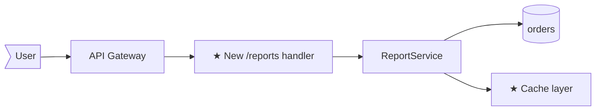
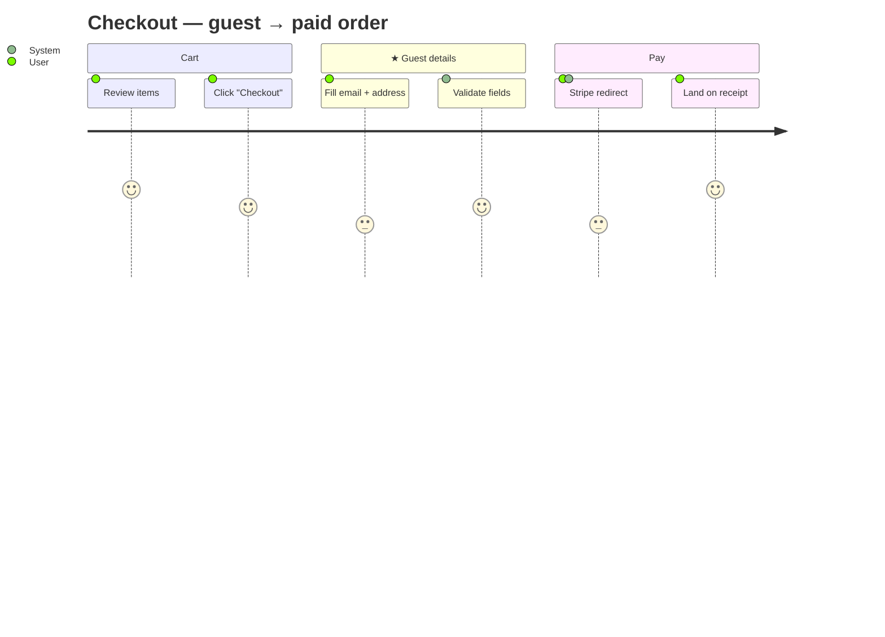
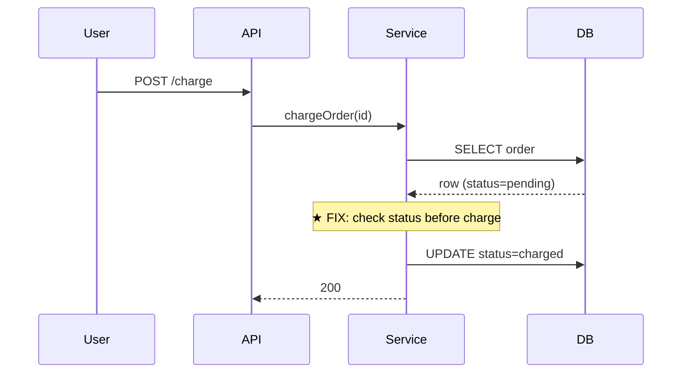
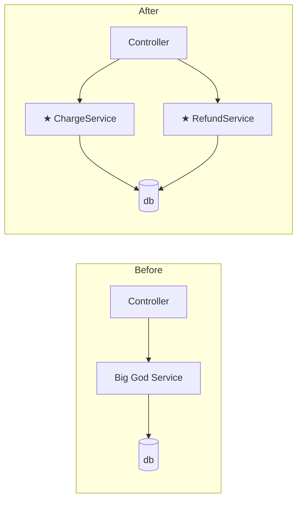
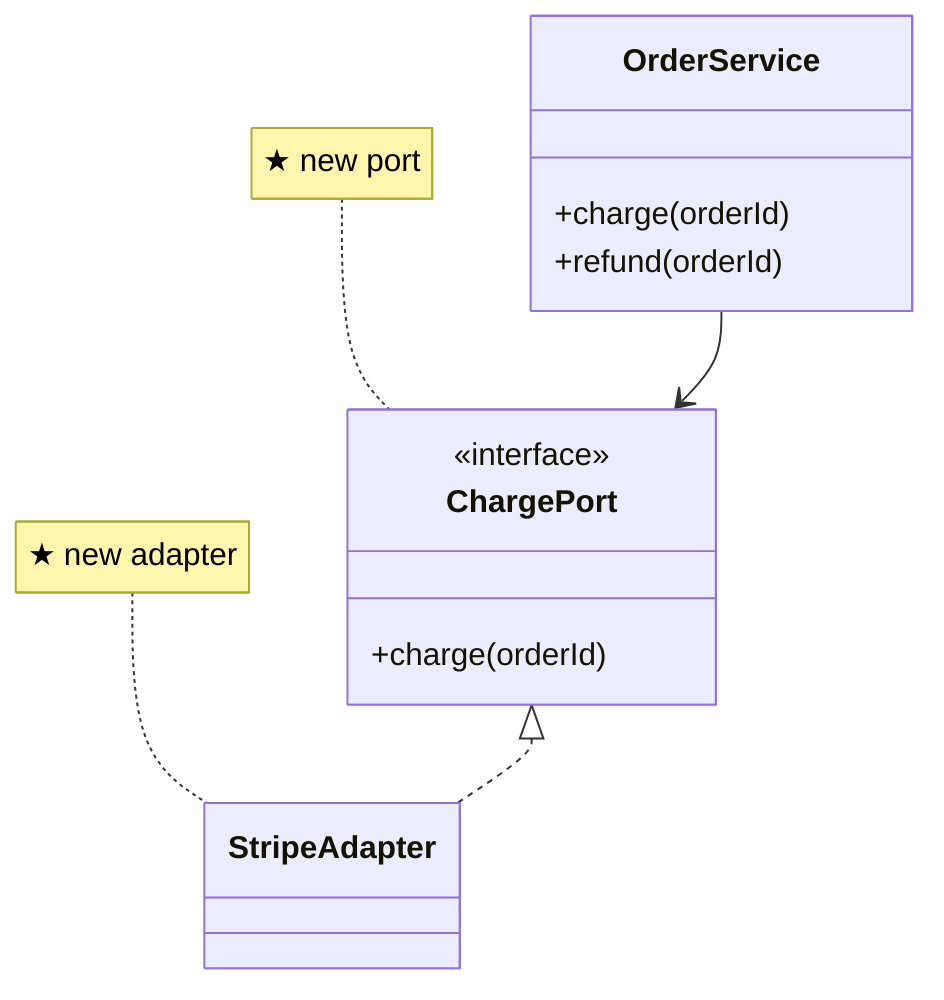
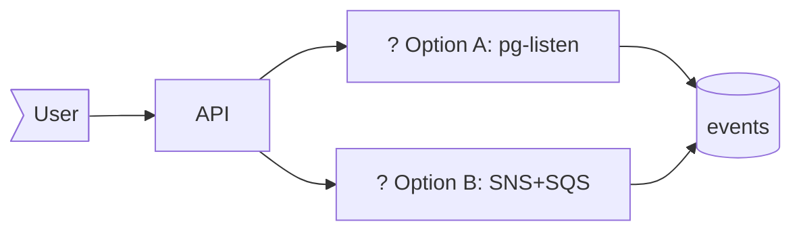

# Architecture Diagrams in Plans

Diagrams are **always required** in `plan.md`. The form scales with `Size`; the *type* defaults from the run's `Type`. Mermaid is the format — renders on GitHub, in VS Code (with extension), in Obsidian, in most markdown viewers, and inside Claude Code's preview pane.

This file is the lookup table when drafting the `## Architecture diagram` section. Keep diagrams small — they exist to make the *seam* of the change legible at a glance, not to redraw the whole system.

## Conventions

- **Mark new pieces with `★`** — both in node labels and in narration. `[★ NewService]`, `★ writes new column`.
- **Mark deleted / removed pieces with `~~strikethrough~~`** in labels: `[~~OldHandler~~]`.
- **Use mermaid's defaults for shape**: `[...]` for processes / components, `(...)` for data stores, `[(...)]` for databases, `>...` for actors / users.
- **Direction**: `LR` (left-to-right) is the default and the most readable. Use `TB` only when you have layers (e.g., a 3-tier app showing top-down).
- **One diagram per plan by default.** L plans may carry two (before + after) — never more without an explicit reason.

## Templates per Type

### `feat` — flowchart, where the new piece plugs in



Worked example: adding a `/reports` endpoint that aggregates orders. `★` marks the two new pieces; everything else is existing. Reviewer sees in 3 seconds: "new handler + new cache, plugged into the API gateway, reads orders." No prose needed.

**UI-heavy `feat` (multi-screen / multi-state flows)** — prefer mermaid `journey` or `sequenceDiagram` over a plain flowchart, so the *user-visible order* is legible. The spec's `## User journey` section names the steps; this diagram visualises them.



Use `sequenceDiagram` instead when the back-and-forth between User / UI / Server matters (e.g., async validation, optimistic updates, retries from the client). Use plain `flowchart` when the change is a single screen or the seam is structural, not user-facing.

### `fix` — sequenceDiagram of the bug path, with the fix marked



Worked example: a bug where charging a non-pending order silently succeeded. `Note over` lines mark exactly where the fix lands. The flow is the existing flow; the fix is one guard inside it.

Alternative for `fix`: a before/after `flowchart` showing the broken branch and the corrected branch — use when the fix changes control flow rather than adding a guard.

### `refactor` — before/after flowchart, OR classDiagram

Before/after flowchart for behavioural restructuring:



classDiagram for structural change (interfaces, inheritance, port/adapter shifts):



The behaviour-equivalence statement in `Approach` says *what* stays the same; the diagram shows *how the shape changes*. Both are required for refactor.

### `chore` / `docs` — one line, OR `N/A`

Most chore/docs work has no architecture impact. State that:

```
**Impact:** N/A — single-file chore. No system impact.
```

When there *is* impact (e.g., a chore that swaps a dep that touches many call sites), use a one-liner:

```
package.json (lodash 4.17.x → 4.17.y) → triggers re-bundle in 14 packages under src/
```

Never delete the section entirely. The discipline is "always have a diagram slot" — even when the content is "no diagram needed".

### `spike` — flowchart with `?` on unanswered nodes



The diagram for a spike is a *question*, not an answer. Multiple branches are explicit. The spike's job is to pick one — `recommendations.md` lands that pick.

## When Size = XS

XS plans still keep the section. Acceptable content:

- `**Impact:** N/A — <reason>` (one-file chore, doc-only change, dep bump with no API surface change)
- `path/to/file (one-line summary of change)` (one-file fix with no system impact)
- A 3-node mermaid `flowchart LR` if even one line of mermaid clarifies it

The cost is ~10 seconds; the value is the habit. Do not skip.

## When Size = L

L plans usually need **two** diagrams:

1. **Before**: the current system at the layer being changed.
2. **After**: the system post-change, with `★` on additions and `~~strikethrough~~` on removals.

Use `subgraph Before { ... }` / `subgraph After { ... }` blocks (as in the refactor example above) or two separate code blocks. Two separate blocks are usually clearer.

For L plans involving multiple actors (services, brokers, external APIs), include a `sequenceDiagram` *in addition* to the flowchart — flowchart shows *shape*, sequence shows *interaction order*. The two views together close the "I see the shape but not the dance" gap.

## Choosing between diagram kinds

| Question to answer | Use |
|--------------------|-----|
| Where does the new piece sit in the system? | `flowchart` |
| What does the user *see and do*, step by step? | `journey` (or `sequenceDiagram` if client↔server back-and-forth matters) |
| What's the order of operations across components? | `sequenceDiagram` |
| What's the structural relationship between types? | `classDiagram` |
| How does the system shape change pre → post? | `flowchart` with before/after subgraphs |
| What's the data shape stored where? | `erDiagram` (rare; only for DB-heavy L plans) |
| What states does an entity move through? | `stateDiagram-v2` (rare; for state-machine features) |

If two questions matter equally, two diagrams. Otherwise one is enough.

## Anti-patterns

- **Don't draw the full system** — only the slice the plan touches, plus one hop of context (the immediate caller, the immediate dependency). More than that is map, not plan.
- **Don't paste architecture diagrams from design docs** — re-draw for *this change*. A reused diagram makes the new pieces blur into the existing system.
- **Don't label nodes with implementation details** — `[OrderService]` not `[OrderService (TypeScript class extending BaseService<T>)]`. The diagram is for the seam, not the code.
- **Don't use color or styling for emphasis** — `★` and `~~strikethrough~~` are enough and render in every viewer.
- **Don't draw what isn't changing** unless it provides essential context. Every node the reader has to parse is attention you've taken from the actual change.
