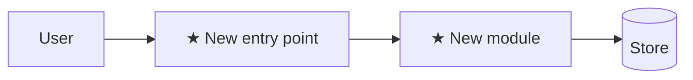

# Plan: <title>

**Spec**: [./spec.md](./spec.md)
**Type**: feat | fix | refactor | chore | docs | spike
**Size**: XS | S | M | L
**Field**: greenfield | brownfield
**Status**: draft | approved | done

> Sections split **build-time** (engineer reads at implement — pulled per-task via `[ref:]`) vs **plan-time** (gate/reviewer only). Reader · Budget · trigger per section → `plan-writing > references/plan-sections.md`.

## Summary

<2–3 sentences: the technical approach + why this over the obvious alternative. Each user story = one vertical slice.>

## Technical Context *(chore/docs: `n/a` per line is fine)*

**Language**: <lang + version> · **Framework**: <key deps>
**Storage**: <db / files / none> · **Testing**: <framework>
**Target**: <platform> · **Perf**: <goal, links SC-###> · **Scale**: <volume>

## Gate check

Against `.claude/rules/fundamentals.md` — name the layers this work crosses + the one-line conduct check:

- **Trust boundary**: <untrusted input → where validated; or "none — no external input">
- **Ponytail**: <cheapest construction that holds; a new dependency needs justification>
- **<other fundamental that fires>**: <a11y / concurrency / database / observability — one line each>

## Phases for this task

<matrix defaults for type=<feat | fix | refactor | chore | docs | spike>, size=<XS|S|M|L> — no deviations>

## Fanout plan

No fanout — single-pass.

## Architecture diagram *(feat/fix/refactor: required — sequenceDiagram for code-bearing work; spike: flowchart with `?` nodes; chore/docs: DELETE)*

---
*Tasks (the executable steps, `T001…`) live in [./tasks.md](./tasks.md). Optional — add when triggered, delete the rest: Current state (brownfield) · Scaffold / Project structure (M/L) · Risks · Rollback · Alternatives. Rules → **lead.md > Mode A** · **plan-writing**.*
